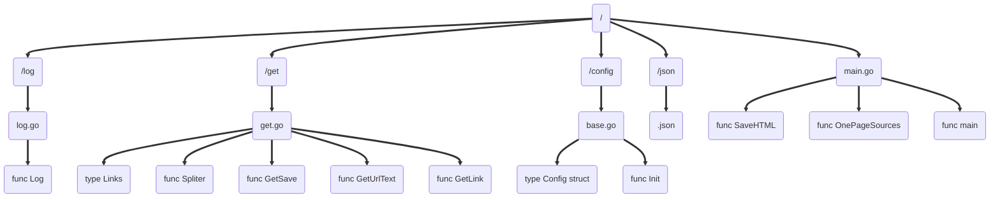
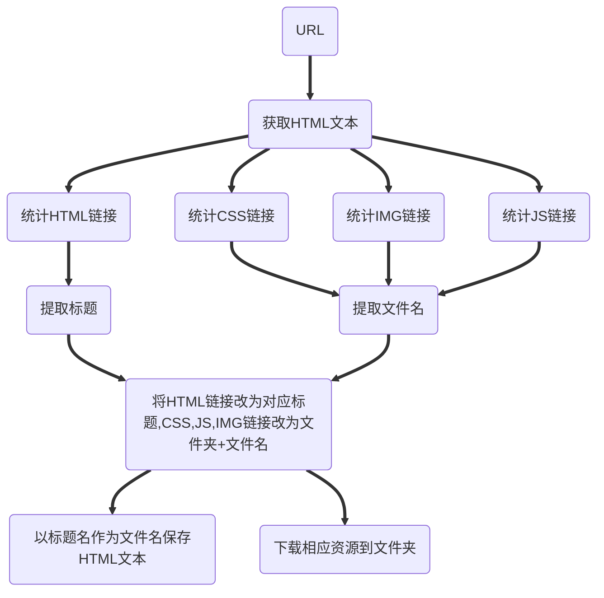
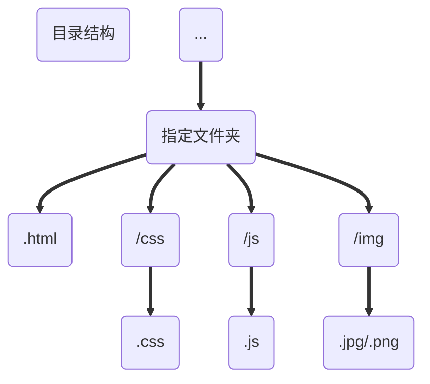
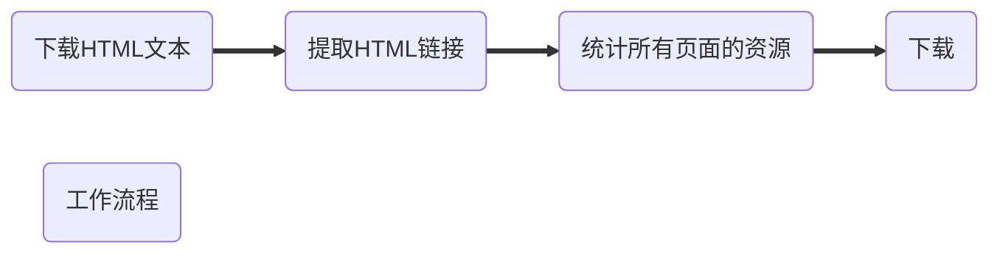

# ToySpider

----

## 目录

[目录](##目录)

[写在前面](##写在前面)

[如何使用](##如何使用)

[业务逻辑](##业务逻辑)

[吐槽](##吐槽)

[写在最后](##写在最后)

## 写在前面

[目录](##目录)

鄙人是菜鸟，网警同志应该不会来抓我吧。

>顾名思义，玩具而已。
>
>用于爬取网站上的教程
>
>力求完美复制：HTML，CSS，JavaScript，图片。
>
>应该不会有人伤心病狂到对用爱发电的网站下黑手吧。

最终效果

>爬取成套的教程，且各项指标正常，页面可正常转跳

## 如何使用

[目录](##目录)

​	[Lv0](### Lv0)

​	[Lv1](### Lv1)

​	[Lv2](###Lv2)

### Lv0

看见那个.exe结尾的东西了吗？点它！然后等，正常情况下是没有任何输出的，在log文件夹里面有输出的日志。

默认是Gin的中文教程，json文件夹里面是菜鸟的正则教程对应的配置。

然后就复制粘贴

### Lv1

通过更改配置文件进行修改

你需要

> JSON会看就行
>
> 一点点前端基础
>
> “深厚”的**正则表达式**功底

```json
{
  "Directory": "Gin/",
  "LinkHead": "https://gin-gonic.com",
  "RxImg": "<link.*?href=\"(.*?\\.png)\"",
  "RxHtml": "<a.*?href=\"(/zh-cn/docs/.*?)\".*?>(.*?)<",
  "RxCss": "<link.*?href=\"(.*?\\.css)\"",
  "RxJs": "<script src=\"(.*?\\.js)\"",
  "Goal": "https://gin-gonic.com/zh-cn/docs/",
  "Link":"gin-gonic.com"
}
```

| “键”      | “值”                                                         |
| --------- | ------------------------------------------------------------ |
| Directory | 保存文件的目录，一定要以“/”结尾，如果以“/”开头则会在当前盘符的根目录下面创建文件夹 |
| LinkHead  | 看提示、顾名思义，填协议+域名                                |
| Goal      | 目标网页地址，将会在这个网页上匹配其他网页的链接             |
| Link      | 顾名思义还是算了吧，填域名                                   |
| Rx…       | 填对应的正则表达式、如果处理不好对方服务器崩了来找你可别提起我 |

==**正则表达式一定要描述准确，尽量保证只匹配你真正需要的**==

==**一定要注意字符的转义，正则和字符串两个层面都要考虑！**==

### Lv2

直接改代码

你需要


* GOLang
    > 并发编程
    > channel通信
    >
    > 文本处理
    >
    > 文件管理
    >
    > 对正则的支持
    >
    > JSON处理
    >
    > HTTP请求
* 心态
	>我的代码可能反人类
	
	代码结构：




## 业务逻辑

[目录](##目录)







## 吐槽

[目录](##目录)

### 图片

关于图片的引用，在我印象里我见到了三种不同的方式

1.缺域名和协议的

```html
 
```

> 这种浏览器会默认在本站内查找

2.缺协议的

```html

```

> 访问时浏览器自动添加

3.啥也不缺的

```html

```

> 如果全长这样该多好

由于鄙人只会用<kbd>http.Get()</kbd>,然而这东西只对上面第三种有效，于是就造就了下面的判断结构

```go
//保存HTML文本
	for a2,a1:=range htmlLink{
		a:=strings.Index(a1,"http://")//有没有协议
		a+=strings.Index(a1,"https://")//找不到返回-1
		if a>= -1{//有其中一个-啥也不缺
			go SaveHTML(a1,a2,htmlLink,cssLink,jsLink,imgLink,over)
		}else if a=strings.Index(a1,".com");a>=0{//只缺协议
			a1=strings.Trim(a1,"/")//除去多余的 /
			go SaveHTML("https://"+a1,a2,htmlLink,cssLink,jsLink,imgLink,over)//http和https好像都行
		}else {//缺域名和协议的-LinkHead上面有提及
			go SaveHTML(conf.LinkHead+a1,a2,htmlLink,cssLink,jsLink,imgLink,over)
		}
	}
```

> 这大过年的，整的我简直不要太那啥。

### 链接

#### 之不同的页面

```html
<a  href="/zh-cn/docs/" class="......">文档</a>
<a  href="/zh-cn/docs/introduction/" class="......">介绍</a>
```

> 不知道发现没有，这俩货的链接是目录，你中有我
>
> 由于鄙人为避免链接重复使用map储存，而map在迭代时是无序的

于是在改链接的时候就出现过下面的情况

```html
<a  href="文档.html" class="......">文档</a>
<a  href="文档.htmlintroduction/" class="......">介绍</a>
```

> 第2行的链接浏览器要是能找到我跟它姓

最后的解决办法：把双引号一起匹配

即：

```go
text=strings.Replace(text,"\""+link+"\"","\""+name1+"\"",-1)
```

#### 之同一个页面

```html
<a href="https://gin-gonic.com/zh-cn/docs/">文档</a>
<a  href="/zh-cn/docs/" class="....">文档</a>
```

> 这…看来我只能来硬的

```go
for name1,link:=range html{
	text=strings.Replace(text,"\"https://"+conf.Link+link+"\"","\""+name1+"\"",-1)
	text=strings.Replace(text,"\"http://"+conf.Link+link+"\"","\""+name1+"\"",-1)
	text=strings.Replace(text,"\""+link+"\"","\""+name1+"\"",-1)
}
```

### 页面标题

```html
 <a class="..." id="..." href="/zh-cn/docs/examples/rendering/">XML/JSON/YAML/ProtoBuf 渲染</a>
```

> 这…自带文件夹？

```go
for _,illegal:=range "\\/:*?\"<>|"{//替换作为文件名时的非法字符
	data[2]=strings.Replace(data[2],string(illegal),"+",-1)
}
```

## 写在最后

[目录](##目录)

编写于鄙人寒假，对我是学生，所以更新什么的就不可能了，我作业还没写来着，应该也没有人会看这个吧，毕竟GitHub上星星排前面的简直太强了，而且几乎全是中国人。不由得想起前些年频频出现的“现象”。