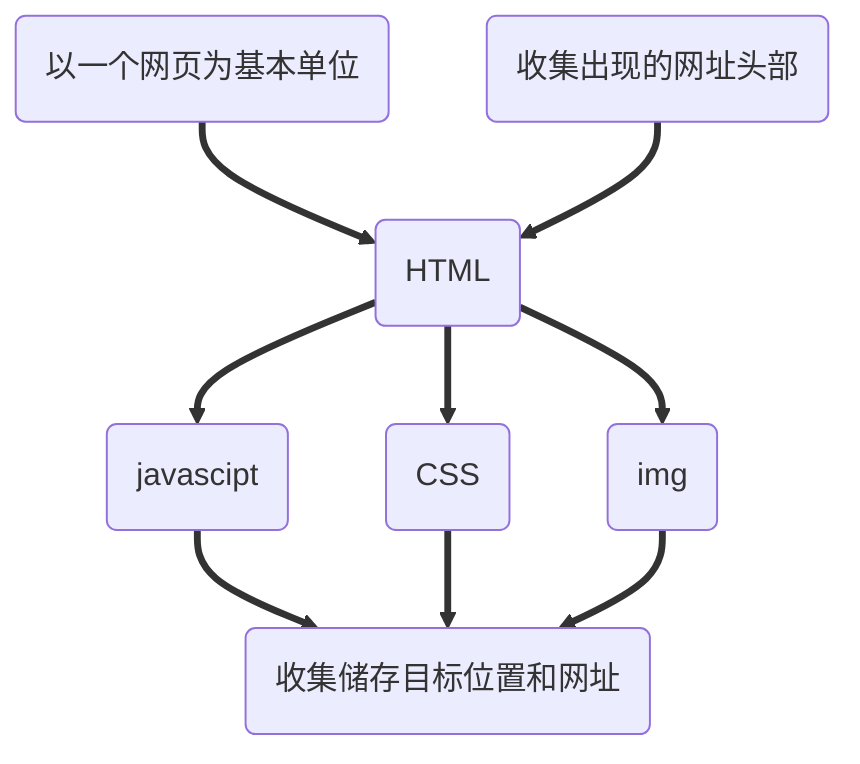
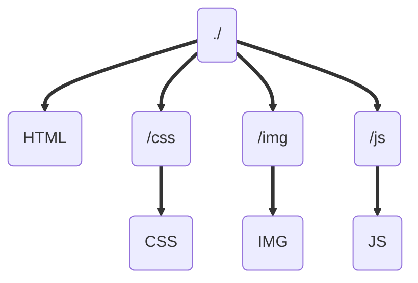

# Spider

>用于爬取网站上的教程
>
>力求完美复制：HTML，CSS，JavaScript，图片

## 路径强制转换

绝对路径->相对路径

```mermaid
graph TD
A(以一个网页为基本单位)==>
HTML(HTML)==>js(javascipt)
HTML==>css(CSS)
HTML==>img(img)
js==>END(收集储存目标位置和网址)
css==>END
img==>END
B(收集出现的网址头部)==>HTML
```

```mermaid
graph TD
/(./)==>HTML(HTML)
/==>css(/css)==>CSS(CSS)
/==>img(/img)==>IMG(IMG)
/==>JS(/js)==>js(JS)
```

