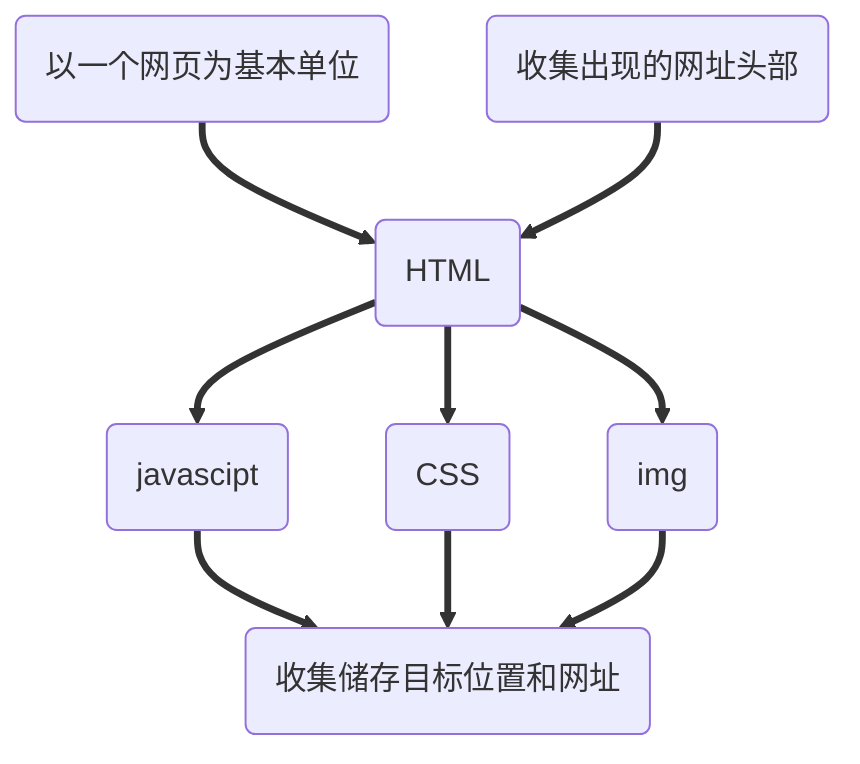
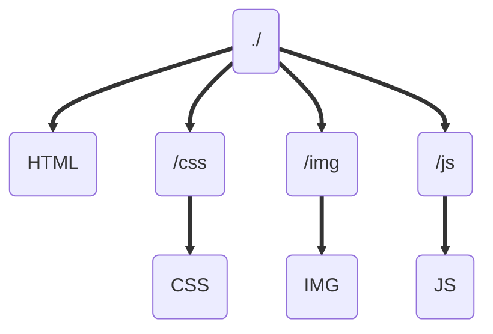
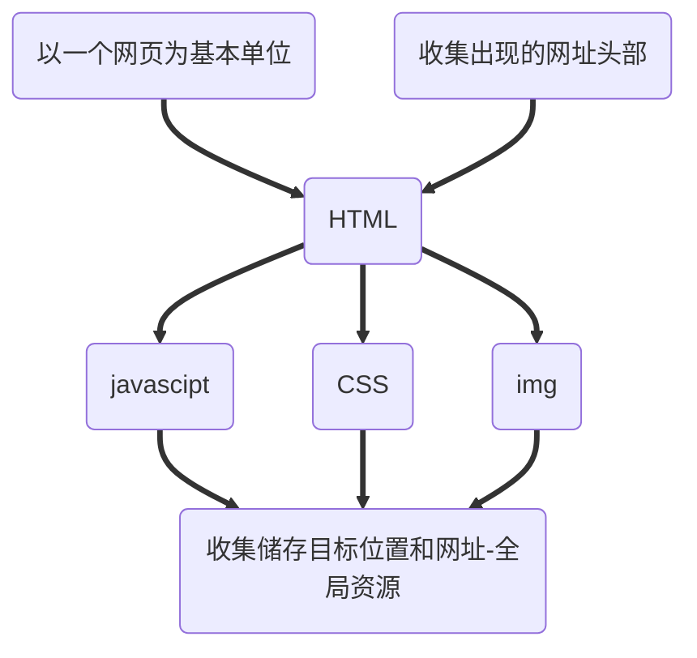
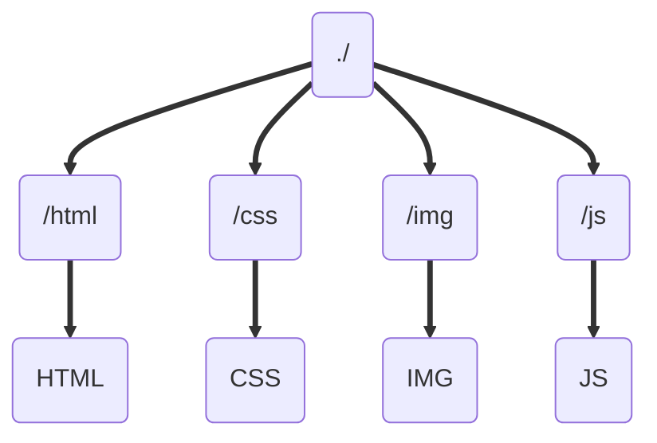
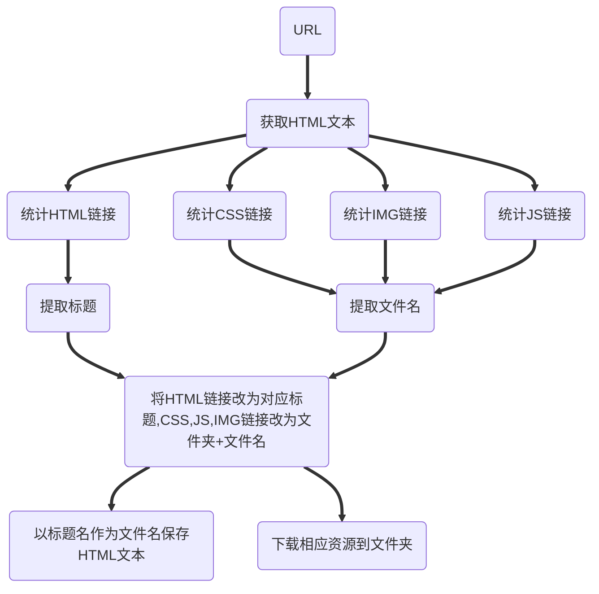
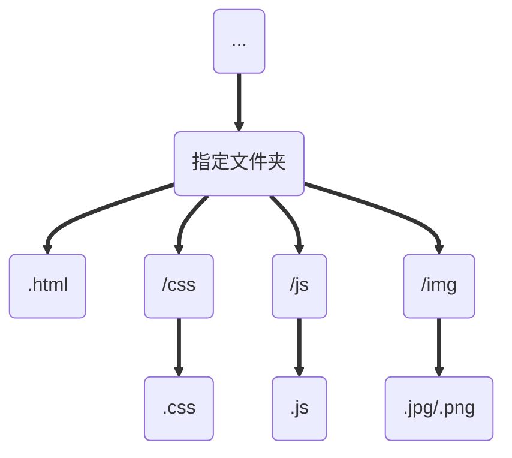

# Spider

>用于爬取网站上的教程
>
>力求完美复制：HTML，CSS，JavaScript，图片

## 1

绝对路径->相对路径

```mermaid
graph TD
A(以一个网页为基本单位)==>
HTML(HTML)==>js(javascipt)
HTML==>css(CSS)
HTML==>img(img)
js==>END(收集储存目标位置和网址)
css==>END
img==>END
B(收集出现的网址头部)==>HTML
```

```mermaid
graph TD
/(./)==>HTML(HTML)
/==>css(/css)==>CSS(CSS)
/==>img(/img)==>IMG(IMG)
/==>JS(/js)==>js(JS)
```

##2

```mermaid
graph TD
A(以一个网页为基本单位)==>
HTML(HTML)==>js(javascipt)
HTML==>css(CSS)
HTML==>img(img)
js==>END(收集储存目标位置和网址-全局资源)
css==>END
img==>END
B(收集出现的网址头部)==>HTML
```

```mermaid
graph TD
/(./)
/==>html(/html)==>HTML(HTML)
/==>css(/css)==>CSS(CSS)
/==>img(/img)==>IMG(IMG)
/==>JS(/js)==>js(JS)
```

## 3

```mermaid
graph TD
1(URL)==>2(获取HTML文本)
2==>3(统计HTML链接)==>7(提取标题)==>9
2==>4(统计CSS链接)==>8(提取文件名)
2==>5(统计IMG链接)==>8
2==>6(统计JS链接)==>8==>9
9(将HTML链接改为对应标题,CSS,JS,IMG链接改为文件夹+文件名)
9==>10(以标题名作为文件名保存HTML文本)
9==>11(下载相应资源到文件夹)
```

```mermaid
graph TD
/(...)
/==>ROOT(指定文件夹)==>html(.html)
ROOT==>CSS(/css)==>css(.css)
ROOT==>JS(/js)==>js(.js)
ROOT==>IMG(/img)==>img(.jpg/.png)
```